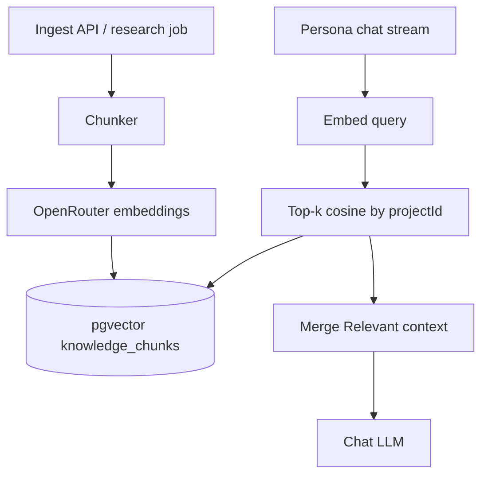

# Chat / project knowledge RAG

**Status:** Accepted — implemented (phase 1) — 2026-08-27  
**Date:** 2026-08-27  
**Surfaces:** Persona chat (`/chat`) · project knowledge ingest  
**Companion:** `specs/domain/chat-document-attachments.md` (session DOCX merge) · `specs/domain/knowledge-pack-publish.md` (Collection distill, not vector store)  
**API:** `specs/api/knowledge-rag.md`  
**Legacy:** AUDION-v2 BGE-M3 + Qdrant `research_chunks` (`knowledge/chat-qdrant-retrieval.md`)

## Purpose

Ground persona answers in **project knowledge** (research dossier, uploaded docs, magazine entries) via retrieval-augmented generation — without a local embedding GPU.

Session DOCX attachments stay on the **fulltext merge** path (`chat-document-attachments.md`). RAG is for **durable, project-scoped corpora** that would blow the context window if dumped whole.

## Decisions (locked)

| Topic | Choice |
|-------|--------|
| Embed provider | **OpenRouter** `/v1/embeddings` preferred; **fallback** `OPENAI_API_KEY` (+ optional `OPENAI_API_BASE_URL`) so staging works without a separate OpenRouter key |
| Default model | `openai/text-embedding-3-small` (1536-d) — same ID for **index and query** (native OpenAI strips `openai/` prefix) |
| Vector store | Postgres on Audion `DATABASE_URL`. Phase 1: **`embedding jsonb` + in-process cosine** (Coolify image `postgres:alpine` lacks pgvector). Migrate to `vector(1536)` when the DB image supports it. |
| Scope key | `projectId` (Audion project / Collection-bound project) |
| Chat injection | Retrieved chunks prepended as **Relevant context** into the **user** turn; optional `sources[]` on stream `done` |
| Soft-fail | Missing key / empty index / embed error → empty sources; chat continues |

### Why not “EchoN’s embedding model”?

ECHON v3 embeds **locally** (`TyKaoz/bge-m3-8bit`, 1024-d, MLX). Audion staging has no ML slot. OpenRouter keeps parity with how we already call cloud LLMs and avoids Coolify GPU/volume coupling.

Re-index is required if the model ID or dimension ever changes.

## Non-goals (this wave)

- Migrating v2 Qdrant corpora
- Guest / TG / embed RAG
- Storion as embedding provider (optional later as **file SSOT** only)
- Replacing Collection Knowledge Pack publish
- Hybrid lexical+ANN (phase 2; cosine-only first)
- Auto-ingest every TipTap keystroke (debounce via save commit only)

## Architecture



## Chunking

| Param | Default (`paths.*`) | Notes |
|-------|---------------------|--------|
| Target chars | `knowledgeRagChunkChars` ≈ 1800 | ~450–600 tokens |
| Overlap chars | `knowledgeRagChunkOverlap` ≈ 200 | Boundary soft-split on `\n\n` then `\n` then space |
| Max chunks / document | `knowledgeRagMaxChunksPerDoc` = 200 | Cap runaway uploads |
| Max ingest file | reuse `chatDocumentUploadMaxBytes` (15 MB) for DOCX; HTML/plain from dossier separately capped |

Chunk text is plain (strip HTML). Each chunk stores `sourceType`, `sourceId`, `filename`/`title`, `ord`.

## Schema (Postgres)

Phase 1 uses **`embedding jsonb`** (Coolify `postgres:alpine` has no pgvector). Cosine scoring runs in-process per `project_id`. Migrate to `vector(1536)` when the DB image supports it.

```text
knowledge_documents
  id text PK
  project_id text NOT NULL
  source_type text NOT NULL   -- 'docx' | 'chapter' | 'research' | 'entry'
  source_ref text
  title text
  status text NOT NULL        -- 'pending' | 'ready' | 'failed'
  error text
  created_at / updated_at timestamptz

knowledge_chunks
  id text PK
  document_id text NOT NULL → knowledge_documents ON DELETE CASCADE
  project_id text NOT NULL
  ord integer NOT NULL
  content text NOT NULL
  token_estimate integer
  embedding jsonb NOT NULL   -- number[1536]
  model_id text NOT NULL
  created_at timestamptz
```

`ensureKnowledgeRagSchema()` runs idempotently when `DATABASE_URL` is set.

Without `DATABASE_URL`: ingest fails soft; retrieve returns `[]`.

## OpenRouter embed client

| Config | Env / path key |
|--------|----------------|
| API key (preferred) | `OPENROUTER_API_KEY` |
| Fallback | `OPENAI_API_KEY` → OpenAI `/v1/embeddings` (strips `openai/` model prefix) |
| Base URL | default `https://openrouter.ai/api/v1` (`OPENROUTER_API_BASE_URL`) |
| Model | `AUDION_RAG_EMBEDDING_MODEL` → default `openai/text-embedding-3-small` |
| Dimension | `paths.knowledgeRagEmbeddingDims` = 1536 |
| Kill-switch | `AUDION_RAG_ENABLED=0` |

Request: `POST {base}/embeddings` with `{ model, input }`. Batch size `paths.knowledgeRagEmbedBatchSize` (16).

OpenRouter headers: `HTTP-Referer` / `X-Title` from staging origin / brand label.

## Retrieval (chat)

1. If `AUDION_RAG_ENABLED` off or no `projectId` → skip.
2. Embed `payload.message` (raw user text, **before** DOCX merge and vision parts).
3. Cosine top‑k (`paths.knowledgeRagTopK` default **5**) filtered by `project_id` and `model_id`.
4. Optional min similarity gate (`paths.knowledgeRagMinScore` default **0.35** cosine similarity).
5. Build block:

```text
### Relevant context
[1] {title} — {snippet}
[2] …
---
```

6. Prepend to model-facing user text **after** DOCX merge order:
   - Order: **Relevant context** → **Attached document(s)** → user content  
   - Inspect URL heuristics still use raw `message` only.

7. Persist UI sources on the assistant turn or stream `done` metadata: `{ id, title, score }[]` (no full chunk dump in transcript by default).

## Ingest triggers (product)

| Trigger | Behaviour |
|---------|-----------|
| Project knowledge chapter save (`PATCH` / research apply) | Auto-sync chapters → RAG (`sourceType` `chapter` / `research`) |
| Persona / TG knowledge entry create/update | Auto-sync when `projectId` set (`sourceType` `entry`) |
| Chapter / entry delete | Remove matching RAG document by `sourceRef` |
| Manual `POST /api/knowledge/rag/ingest` | Still available for ops / DOCX; **no separate “Index for chat” CTA** |

UI shows status badges (`In chat` / `Indexing…` / failed) on dossier cards — no extra index button.

Collection Knowledge Pack publish remains a **separate** distill path (`knowledge-pack-publish.md`) — RAG does not write to Plexon.

## Relation to session DOCX

| Path | When |
|------|------|
| Session attach + merge | Ephemeral brief for **this** turn (`documentIds`) |
| Knowledge RAG | Project corpus reused across conversations |

A user may both attach a DOCX **and** retrieve project chunks in one turn.

## Acceptance (when implemented)

1. Specs + `paths` keys + contracts for chunk/source shapes exist.
2. Ingest DOCX/plain for a `projectId` produces `ready` document + ≥1 chunk with 1536-d embedding.
3. Persona stream with `projectId` injects Relevant context when chunks exist; soft-empty otherwise.
4. Changing embedding model without re-index is rejected (filter by `model_id`).
5. Guest/TG never call retrieve.
6. Unit tests: chunker boundaries, merge order, retrieve mock without live OpenRouter.
7. Staging Coolify: `OPENROUTER_API_KEY` + pgvector-capable Postgres.

## Out of scope (remain)

- Local FlagEmbedding / MLX  
- Qdrant  
- Legacy `.doc`  
- Cross-project retrieval  
- Automatic citation markers `[n]` enforcement in the LLM (optional phase 2)
